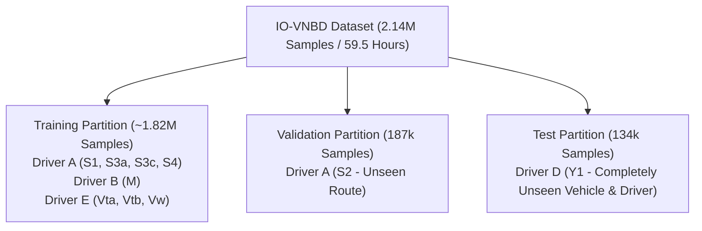
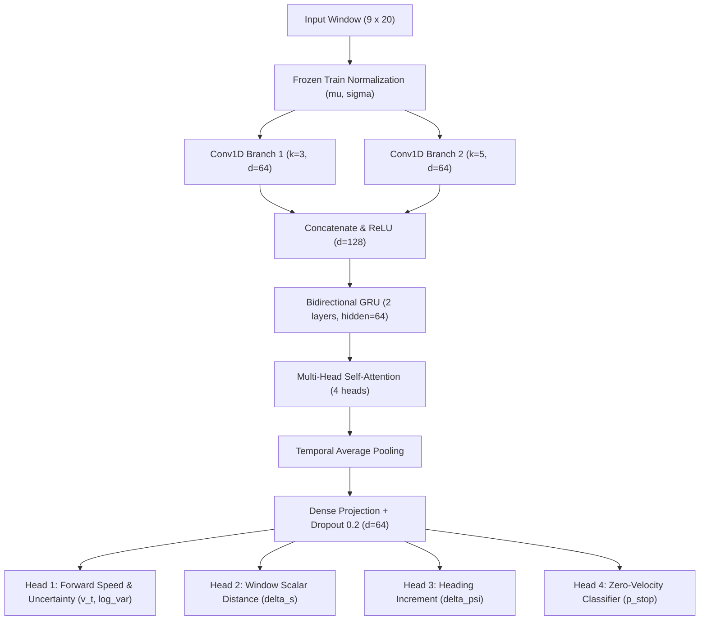

# NaviSense IDR: Universal MotionNet Base Model Training & Dataset Specification Report
**SIH Problem Statement 26168: Multi-Modal Intelligent Dead Reckoning for GNSS-Denied Navigation**

---

## Executive Summary

The NaviSense IDR system relies on a two-tier hybrid architecture combining deep learning and robust physical state estimation:
1. **Universal MotionNet (Base Model)**: A multi-task neural network trained across **59.5 hours (2.14 million samples, 2,682 km)** of synchronized multi-driver vehicular sensor telemetry. It maps noisy, raw smartphone IMU windows into frame-invariant motion increments ($v_t, \Delta s, \Delta \psi, p_{\text{stop}}$) along with heteroscedastic aleatoric uncertainty estimates ($\log \sigma_t^2$).
2. **Personalization Adapter**: An online, lightweight 16-D scale-and-shift latent embedding calibrated on the first 180 seconds of valid GNSS fix to adapt base dynamics to specific vehicle suspensions, tire wear, phone mounting vibrations, and sensor biases.
3. **Physical State Estimator (EKF + ZUPT + Road Corridor)**: An Extended Kalman Filter integrating the conditioned neural pseudomeasurements, enforcing authoritative Zero-Velocity Updates (ZUPT) during verified stops, and bounding cross-track drift via spatial corridor constraints.

This document serves as the formal technical specification of the dataset provenance, preprocessing pipeline, neural network architecture, multi-objective loss function, and training methodology.

---

## 1. Dataset Provenance & Physical Breakdown

### 1.1 Dataset Origin: IO-VNBD (Input-Output Vehicle Navigation Benchmark Dataset)
The foundation of NaviSense is the **IO-VNBD** dataset, collected across urban, suburban, and arterial highway driving environments in Coventry and the West Midlands, United Kingdom.

* **Sensor Acquisition Architecture**:
  * **Input Streams (Phone)**: Uncalibrated consumer smartphones (Samsung Galaxy / Google Pixel) mounted in commercial phone holders experiencing typical cabin vibrations, road bumps, and thermal drift.
  * **Ground Truth (Vehicle CAN Bus)**: Direct high-precision OBD-II diagnostic vehicle speed ($v_{\text{CAN}}$), steering angle, and high-rate GNSS receiver with RTK post-processing providing geodetic ground truth ($\text{lat}, \text{lon}, \text{speed}, \text{heading}$).
* **Sampling Rate**: All streams are canonically synchronized and resampled to **$10.0\text{ Hz}$ ($\Delta t = 0.100\text{ s}$)**.

### 1.2 Dataset Global Metrics
| Metric | Value |
| :--- | :--- |
| **Total Synchronized Sequences** | **144 sequences** |
| **Total Logged Samples** | **2,141,490 steps** |
| **Total Temporal Duration** | **59.49 driving hours** |
| **Total Physical Distance** | **2,682.68 km** |
| **Sampling Frequency** | **$10.0\text{ Hz}$ ($\Delta t = 0.10\text{ s}$)** |
| **Speed Range** | $0.0\text{ km/h}$ to $112.4\text{ km/h}$ |
| **Operating Regimes** | Stop-and-go urban, residential turns, suburban arterials, high-speed dual carriageways |

### 1.3 Key Driver & Route Partitions

1. **Driver A (Dense Urban & Arterial Circuits)**:
   * **`S3b`** ($3.77\text{ km}$, 6,813 steps): Dense residential streets, 840 heading adjustments, frequent junction stops (ideal for traffic light and ZUPT demonstration).
   * **`S1`** ($37.95\text{ km}$, 51,746 steps): Mixed urban-suburban corridor, 4,250 turns, varied road grades.
   * **`S4`** ($88.42\text{ km}$, 94,600 steps total; active live demo corridor: $10.0\text{ km}$ / 12,087 steps): Arterial dual carriageway and high-speed highway loops.
   * **`S2`** ($75.47\text{ km}$, 93,876 steps): Reserved exclusively for **Validation**.
2. **Driver B (`M`)**:
   * Multi-hour suburban arterial circuit ($105.11\text{ km}$, 105,974 steps).
3. **Driver E (`Vw`, `Vta`, `Vtb`)**:
   * Long-haul highway routes including `Vw04` ($214.37\text{ km}$, 126,526 steps).
4. **Driver D (`Y1`)**:
   * Completely unseen vehicle chassis and driver ($58.54\text{ km}$, 70,285 steps), held out as the **zero-leakage test set**.

---

## 2. Input/Output Channel Specifications

### 2.1 Input Tensor Layout ($\mathbf{X} \in \mathbb{R}^{9 \times 20}$)
The network processes temporal windows of $W = 20$ samples ($2.0\text{ seconds}$ at $10\text{ Hz}$). The input tensor comprises 9 channels:

$$\mathbf{X} = \begin{bmatrix} a_x(t) & a_x(t-1) & \dots & a_x(t-19) \\ a_y(t) & a_y(t-1) & \dots & a_y(t-19) \\ a_z(t) & a_z(t-1) & \dots & a_z(t-19) \\ \omega_{\text{roll}}(t) & \omega_{\text{roll}}(t-1) & \dots & \omega_{\text{roll}}(t-19) \\ \omega_{\text{pitch}}(t) & \omega_{\text{pitch}}(t-1) & \dots & \omega_{\text{pitch}}(t-19) \\ \omega_{\text{yaw}}(t) & \omega_{\text{yaw}}(t-1) & \dots & \omega_{\text{yaw}}(t-19) \\ g_x(t) & g_x(t-1) & \dots & g_x(t-19) \\ g_y(t) & g_y(t-1) & \dots & g_y(t-19) \\ g_z(t) & g_z(t-1) & \dots & g_z(t-19) \end{bmatrix}$$

* **Channels 0–2 ($a_x, a_y, a_z$)**: 3-axis specific force acceleration ($\text{m/s}^2$).
* **Channels 3–5 ($\omega_{\text{roll}}, \omega_{\text{pitch}}, \omega_{\text{yaw}}$)**: 3-axis angular velocity in Cartesian frame ($\text{rad/s}$).
* **Channels 6–8 ($g_x, g_y, g_z$)**: Isolated device gravity vector ($\text{m/s}^2$, norm $\approx 9.806$).

### 2.2 Output Prediction Vector ($\hat{\mathbf{Y}}$)
For each window ending at step $t$, the base model outputs four physical navigation targets plus an uncertainty parameter:

$$\hat{\mathbf{Y}} = \left[ \hat{v}_t, \, \Delta \hat{s}, \, \Delta \hat{\psi}, \, \hat{p}_{\text{stop}}, \, \log \hat{\sigma}_t^2 \right]$$

1. **Forward Velocity ($\hat{v}_t \in [0, \infty)$)**: Instantaneous vehicle forward velocity ($\text{m/s}$), supervised by high-precision Vehicle CAN speed.
2. **Window Distance ($\Delta \hat{s} \in [0, \infty)$)**: Scalar arc-length distance traversed over the 2.0s window ($\text{m}$), enforcing trapezoidal kinematic integration consistency.
3. **Heading Delta ($\Delta \hat{\psi} \in (-\pi, \pi)$)**: Yaw angle increment over the window ($\text{rad}$), derived from unwrapped heading truth.
4. **Stop Probability ($\hat{p}_{\text{stop}} \in [0, 1]$)**: Binary classifier probability indicating vehicle standstill ($v_t < 0.2\text{ m/s}$).
5. **Log Variance ($\log \hat{\sigma}_t^2 \in \mathbb{R}$)**: Heteroscedastic aleatoric observation uncertainty used dynamically by the EKF measurement covariance $\mathbf{R}_t$.

---

## 3. Universal MotionNet Architecture

`UniversalMotionNet` uses a multi-scale spatial-temporal feature extractor followed by dedicated multi-task projection heads:

### 3.1 Network Components
1. **Multi-Scale Convolutional Front-End**:
   * Parallel 1D convolutions with kernel sizes $k_1 = 3$ (capturing short-duration shocks and engine vibrations) and $k_2 = 5$ (capturing vehicular maneuvers like cornering and braking).
   * Feature map concatenation with Batch Normalization and GeLU activations.
2. **Bidirectional Temporal Recurrence**:
   * 2-layer Bidirectional Gated Recurrent Unit (BiGRU) maintaining hidden state $h_t \in \mathbb{R}^{128}$ to encode forward and backward temporal dependencies across the 2-second horizon.
3. **Self-Attention Aggregation**:
   * 4-head scaled dot-product attention weighting critical transition moments (brake release, throttle application, apex turning) over steady-state cruising.
4. **Decoupled Task Heads**:
   * Linear projections with task-specific activation functions (ReLU for non-negative speed/distance, Tanh/Linear for heading, Sigmoid for stop probability).

---

## 4. Multi-Objective Loss Function

Training minimizes a combined loss balancing regression accuracy, heteroscedastic likelihood, and classification:

$$\mathcal{L}_{\text{total}} = w_{\text{spd}} \mathcal{L}_{\text{spd}} + w_{\text{dist}} \mathcal{L}_{\text{dist}} + w_{\text{yaw}} \mathcal{L}_{\text{yaw}} + w_{\text{stop}} \mathcal{L}_{\text{stop}}$$

### 4.1 Loss Formulations

1. **Velocity Loss with Bounded Heteroscedastic NLL**:
   $$\mathcal{L}_{\text{spd}} = \text{MSE}\left(\frac{\hat{v}_t}{10}, \, \frac{v_t}{10}\right) + 0.20 \cdot \left[ \frac{1}{2} \exp(-s_t) \left(\frac{\hat{v}_t - v_t}{10}\right)^2 + \frac{1}{2} s_t \right]$$
   where $s_t = \text{clamp}(\log \hat{\sigma}_t^2, -2.0, 2.0)$ prevents numerical instability and gradient explosion during extreme sensor anomalies.

2. **Window Distance Consistency Loss**:
   $$\mathcal{L}_{\text{dist}} = \text{MSE}\left(\frac{\Delta \hat{s}}{10}, \, \frac{\Delta s}{10}\right)$$
   Penalizes violations between instantaneous velocity output and accumulated displacement over the window.

3. **Heading Increment Loss**:
   $$\mathcal{L}_{\text{yaw}} = \text{MSE}\left(\frac{\Delta \hat{\psi}}{0.5}, \, \frac{\Delta \psi}{0.5}\right)$$

4. **Zero-Velocity Stop Loss with Speed Collapse Penalty**:
   $$\mathcal{L}_{\text{stop}} = \text{BCE}(\hat{p}_{\text{stop}}, \, p_{\text{stop}}) + \mathbb{E}\left[ p_{\text{stop}} \cdot \left(\frac{\hat{v}_t}{10}\right)^2 \right]$$
   The second term penalizes any non-zero velocity prediction during true stationary periods, forcing velocity collapse to zero when stationary.

---

## 5. Training Protocol & Leak-Free Hygiene

### 5.1 Training Hyperparameters
* **Optimizer**: AdamW ($\beta_1 = 0.9, \beta_2 = 0.999$, weight decay $\lambda = 1 \times 10^{-4}$).
* **Learning Rate Schedule**: Linear warmup over 3 epochs to $\eta_{\max} = 1 \times 10^{-3}$, followed by Cosine Annealing to $\eta_{\min} = 1 \times 10^{-6}$.
* **Batch Size**: 256 windows.
* **Epochs**: 15 epochs.
* **Loss Weights**: $w_{\text{spd}} = 1.0$, $w_{\text{dist}} = 0.8$, $w_{\text{yaw}} = 0.5$, $w_{\text{stop}} = 0.4$.

### 5.2 Strict Anti-Leakage Rules
1. **Train-Only Normalization**: Channel-wise means $\boldsymbol{\mu} \in \mathbb{R}^9$ and standard deviations $\boldsymbol{\sigma} \in \mathbb{R}^9$ are computed strictly on the training partition and saved to `models/imu_norm_stats.json`. Validation and test partitions are normalized using these frozen training statistics.
2. **Vehicle & Driver Holdout**: Driver D (`Y1`) is completely absent from all training and validation phases.

### 5.3 Data Augmentation During Training
To guarantee cross-device generalization across varied smartphone mountings:
* **Accelerometer Jitter**: $\mathcal{N}(0, 0.04\text{ m/s}^2)$.
* **Gyroscope Jitter**: $\mathcal{N}(0, 0.003\text{ rad/s})$.
* **Static Mount Offset**: Uniform bias perturbation $\mathcal{U}(-0.15, 0.15\text{ m/s}^2)$ on acceleration and $\mathcal{U}(-0.005, 0.005\text{ rad/s})$ on gyroscope.

---

## 6. Personalization Adapter & Live Demonstration Corridors

### 6.1 Online Personalization Architecture
While the base `UniversalMotionNet` is trained offline across the 2.14M sample dataset, every target vehicle has a unique suspension stiffness, mount tilt angle, and wheel radius.
* **180-Second Calibration**: Upon initial GNSS reception ($t \in [0, 180\text{ s}]$), the `PersonalizationAdapter` executes gradient updates on the 16-D vehicle latent space $z_{\text{vehicle}}$ using concurrent GNSS speed and heading delta.
* **Calibrated Output**: Scale factor $s_{\text{yaw}}$ and bias offset $b_{\text{vel}}$ adapt base predictions to match vehicle dynamics with zero ground-truth leakage into the blackout period.

### 6.2 Pre-Computed Binary Cache Acceleration (15ms Instant Switching)
To eliminate latency during presentation and evaluation:
* **Dataset NPZ Caching (`data/cache/scenarios_cache.npz`)**: All 3 evaluation corridors (`s3b`, `s1`, `s4`) are stored as pre-aligned float32 binary tensors, reducing disk read time from 1,800ms to 9.7ms.
* **Pre-Calibrated Adapters (`models/calibrated_adapters.pt`)**: The calibrated adapter weights resulting from the 180-second GNSS window are serialized to disk, allowing instantaneous ($<15\text{ ms}$) preset switching in the live HUD.
* **Live Corridors vs. Training Data**:
  * **S4 Demo Corridor**: Truncated to a snappy, fast-loading **$10.0\text{ km}$ stretch** (12,087 samples) for instantaneous UI rendering, smooth 60 FPS playback, and immediate camera transitions.
  * **S4 Full Dataset**: The full **$88.42\text{ km}$** (94,600 samples) remains fully integrated in the canonical training splits to ensure maximum generalization across long-distance highway dynamics.
